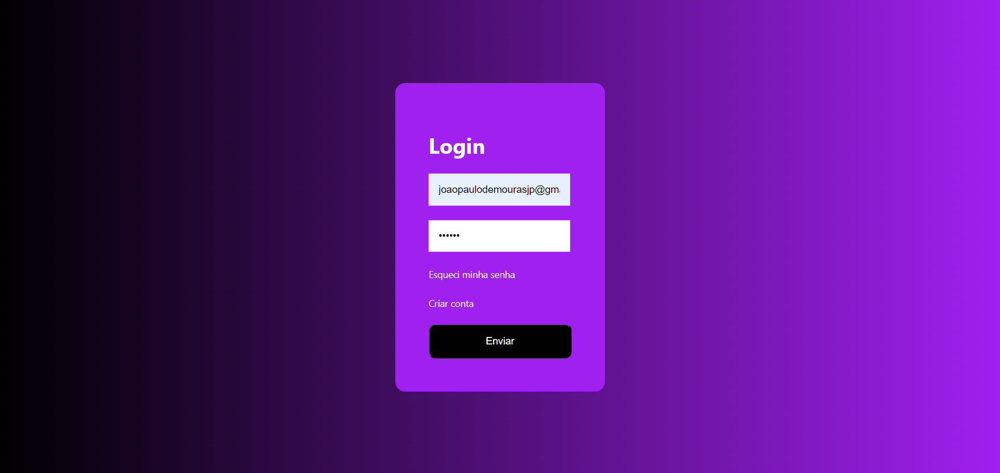

## Indice
- [Autor](#autor)
- [Desafio Focus](#desafio-focus-consultoria---período-trainee)
  - [Dependências](#dependências)
    - [Visual Studio Code](#vs-code)
        - [Live Server](#live-server)
    - [Git](#git)
    - [Node.js](#nodejs)
    - [NPM](#npm)
  - [Instalação](#instalação)
  - [Endpoints](#endpoints)
## Autor

<a href="https://www.linkedin.com/in/joão-moura-7ab135209">
 
  
 <b>João Paulo de Moura</b></a> 
  

## Desafio Focus Consultoria - Período Trainee
Este projeto foi desenvolvido durante o período trainee da Focus Consultoria. O desafio consistia em criar uma tela de login responsiva e visualmente agradável. Foi implementada a funcionalidade de validação dos campos, que identifica quando o usuário tenta enviar o formulário com campos em branco. Além disso, foram adicionadas as páginas de cadastro e recuperação de senha, garantindo uma experiência de usuário completa e funcional.

### Dependências

#### VS Code
Para instalar o Visual Studio Code, siga estes passos:

1. Acesse o site oficial do [Visual Studio Code](https://code.visualstudio.com/Download).
2. Clique no botão de download para a versão do seu sistema operacional (Windows, macOS ou Linux).
3. Após o download, abra o arquivo de instalação e siga as instruções na tela.
4. Durante a instalação, você pode escolher o local de instalação e se deseja criar um atalho na área de trabalho.
5. Após a instalação, abra o Visual Studio Code e comece a usar!

#### Live Server
1. Abra o Visual Studio Code.
2. Vá até a barra lateral esquerda e clique no ícone de Extensões (ícone de quadrado com um pequeno quadrado no canto superior direito).
3. Na barra de pesquisa, digite Live Server.
4. Nos resultados da pesquisa, clique na extensão Live Server desenvolvida por Ritwick Dey.
5. Clique no botão Install para instalar a extensão.
6. Após a instalação, você verá a opção de Abrir com Live Server quando clicar com o botão direito do mouse em um arquivo HTML no VS Code ou usar o atalho Alt+L Alt+O.

#### Git
Para instalar o Git, você pode seguir estes passos:

1. Acesse o site oficial do [Git](https://git-scm.com/download) e faça o download do instalador para o seu sistema operacional.
2. Execute o arquivo de instalação e siga as instruções na tela.
3. Durante a instalação, você pode escolher as opções que deseja, como o editor de texto padrão e o local de instalação.
4. Após a instalação, abra o prompt de comando ou terminal e digite `git --version` para verificar se o Git foi instalado corretamente.

#### Node.js
Para instalar o Node.js, você pode seguir estes passos:

1. Acesse o site oficial do [Node.js](https://nodejs.org/pt).
2. Baixe o instalador **.msi** para o seu sistema operacional **Windows**.
3. Execute o instalador e siga as instruções na tela.
4. Durante a instalação, você pode escolher o local de instalação e se deseja adicionar o Node.js ao **PATH** do sistema.
5. Após a instalação, abra o **prompt de comando** ou o **terminal** e digite **node -v** para verificar se a instalação foi bem-sucedida.

#### NPM
O NPM já vem instalado junto com o Node.js, então você não precisa instalá-lo separadamente! 

### Instalação
Para instalar e configurar a api, você pode seguir estes passos:
1. Clonando o repositório:
- Obtenha o link do repositório: Acesse o repositório da [api](https://github.com/JPaulo-mrs/Desafio_Focus) no GitHub, clique em code e depois em copiar.
- Clone o repositório: Abra o terminal e navegue até o diretório onde deseja clonar o projeto. Execute o seguinte comando, substituindo <link-do-repositorio> pelo link real do repositório:
~~~bash
git clone <link-do-repositorio>
~~~

2. Instalando as dependências do projeto:
- Navegue até o diretório do projeto: No terminal, use o comando cd para navegar até o diretório do projeto clonado.
- Instale as dependências: Execute o seguinte comando:
~~~bash
npm install
~~~
- Isso irá baixar e instalar todas as dependências do projeto.

3. Iniciando a API localmente:

- Execute a API: Execute o seguinte comando no terminal:
~~~bash
npm start
~~~
- Isso irá iniciar a API localmente.
- Acesse a API: Clique no botão "Go Live" no canto inferior direito. Você verá a página inicial da API.

### Endpoints
**Login:**

* **Endpoint:** `/`
* **Métodos:**
    * **POST (Logar no site):**
        * **Parâmetros:**
            * `Email` (string): Email para realizar o login.
            * `Senha` (string): Senha do email cadastrado.
        * **Resposta:** Retorna se foi possível realizar o login. Caso não for possível irá retornar uma mensagem informando o motivo.

**Usuários:**

* **Endpoint:** `/user`
* **Métodos:**
    * **POST (Cadastrar usuário):**
        * **Parâmetros:**
            * `Id` (string): ID do usuário.
            * `Email` (string): Email do usuário.
            * `Senha` (string): Senha do usuário.
        * **Resposta:** Retorna se foi possível cadastrar o usuário. Caso não for possível irá retornar uma mensagem informando o motivo.
    * **PUT (Mudar senha):**
        * **Parâmetros:**
            * `User` (string): Email do usuário.
            * `newPassword` (int): Nova senha do usuário.
        * **Resposta:** Retorna se foi possível cadastrar o usuário. Caso não for possível irá retornar uma mensagem informando o motivo.